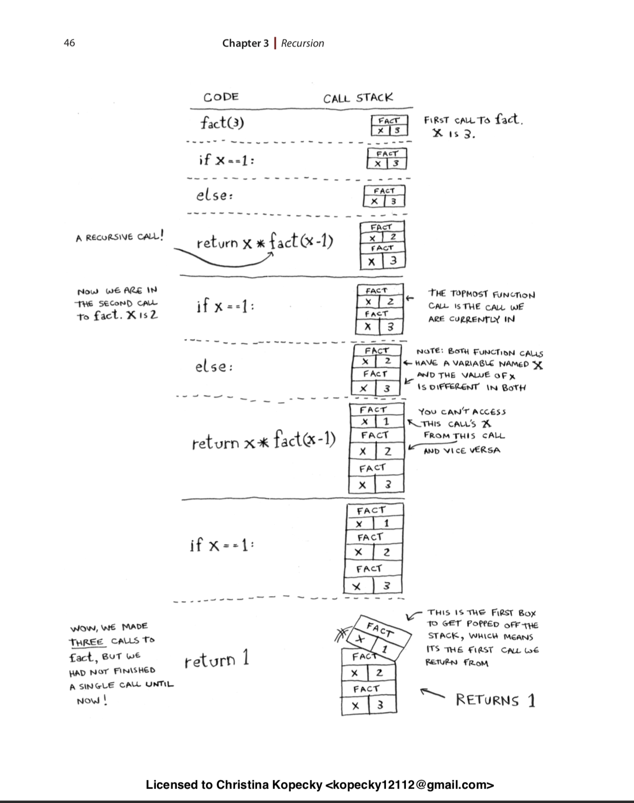

### The call stack with recursion

Recursive functions use the call stack too!

So with the way recursion works ... each time x is called and multipled with the recursive function...that x is put on a stack. The last entry in that stack is one. Then each call is popped off the stack as it's multipled with the next recursive call until we have no more stack elements left. 

